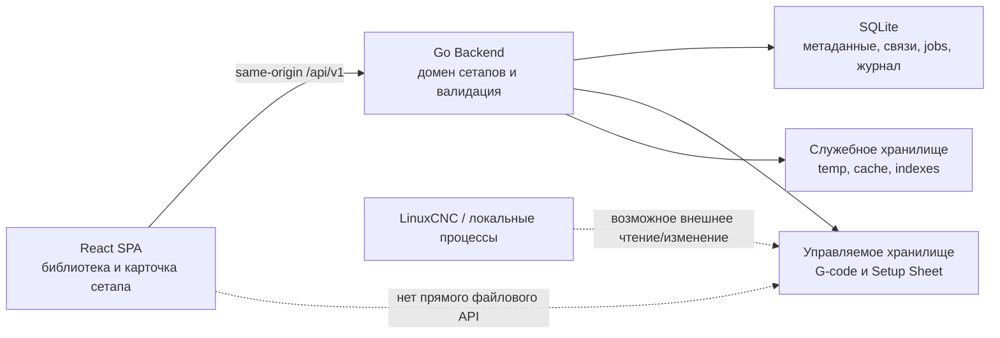

# Web Setup Manager — функциональные требования

| Атрибут | Значение |
|---|---|
| Статус | Черновик новой продуктовой модели, готовый к проверке сценариев |
| Версия | 2.0 |
| Дата | 20 августа 2026 г. |
| Основной сценарий | Локальное управление комплектами технологической подготовки станка |
| Backend | Go |
| Frontend | React |
| Локальная БД | SQLite |

---

## 1. Назначение документа

Документ определяет функциональные и нефункциональные требования к локальному веб-приложению для управления **сетапами** станка.

Сетап является основной сущностью продукта. Он объединяет:

- одну или несколько G-code-программ;
- одну основную Setup Sheet в PDF или самостоятельном HTML;
- название, описание и другие метаданные;
- состояние готовности;
- историю изменений и источник импорта.

Приложение не является файловым менеджером. Оператор работает с сетапами и их содержимым, а не с произвольным деревом каталогов. Файловое хранилище является внутренней деталью реализации и не определяет навигацию, API или пользовательские сценарии.

### 1.1. Уровни обязательности

| Уровень | Значение |
|---|---|
| **MUST / P0** | Обязательно для первой производственной версии |
| **SHOULD / P1** | Следующий этап либо P0 при приемлемой стоимости |
| **COULD / P2** | Возможное дальнейшее развитие |

Идентификаторы требований должны сохраняться при декомпозиции в задачи, API-контракты и тесты.

### 1.2. Основное продуктовое решение

```text
Не: каталог → файл G-code → прикреплённая документация

А:  сетап → программы + Setup Sheet + метаданные + состояние
```

Просмотр, загрузка, замена и удаление файла допустимы только как действия над содержимым конкретного сетапа. Универсальные операции над произвольными файлами и каталогами не являются частью продукта.

## 2. Цели продукта

1. Дать оператору единый каталог законченных и незаконченных сетапов.
2. Позволить быстро понять состав сетапа и его готовность к работе.
3. Хранить G-code и технологическую документацию как единый логический комплект.
4. Сделать импорт и обновление комплекта атомарными и предсказуемыми.
5. Позволить выбрать один готовый сетап как текущий, не запуская и не исполняя G-code.
6. Безопасно просматривать очень большие G-code без внешнего редактора и без загрузки файла целиком в память.
7. Сохранить работоспособность на компьютере станка с ограниченными ресурсами и без облачных сервисов.
8. Не допустить чтение или изменение данных за пределами управляемого хранилища даже при специально сформированном запросе, символьных ссылках и гонках файловой системы.

## 3. Термины и акторы

| Термин | Определение |
|---|---|
| **Оператор** | Основной локальный пользователь приложения на станке |
| **Сетап / Setup** | Логический комплект технологической подготовки с устойчивым ID, метаданными, программами и документацией |
| **Программа** | G-code-файл, входящий в сетап |
| **Основная программа** | Программа, отмеченная как рекомендуемая точка входа в сетап; в P0 не более одной |
| **Setup Sheet** | Основная технологическая инструкция сетапа в PDF или самостоятельном HTML |
| **Материал** | Дополнительный документ или файл сетапа; поддержка произвольных материалов относится к P1 |
| **Черновик** | Сетап, который ещё не прошёл проверку готовности или был изменён после неё |
| **Готовый сетап** | Сетап, успешно прошедший обязательные проверки |
| **Текущий сетап** | Один готовый сетап, явно выбранный оператором для текущей работы; выбор ничего не исполняет |
| **Revision** | Монотонный номер успешного изменения состава или метаданных сетапа; не является полноценной системой контроля версий |
| **Артефакт** | Хранимый объект сетапа: программа, Setup Sheet или дополнительный материал |
| **Импорт-сессия** | Временная атомарная сборка нового сетапа до его публикации в библиотеке |
| **Управляемое хранилище** | Область для содержимого сетапов, доступная только через доменный API Backend |
| **Служебное хранилище** | Область для SQLite, временных объектов, кэша, журнала и внутренних индексов |
| **Версия объекта** | Непрозрачное значение для обнаружения изменения артефакта между чтением и операцией |

В P0 предполагается один локальный оператор и один экземпляр приложения на одном станке. Операционная система, LinuxCNC и другие локальные процессы считаются внешними акторами, способными читать или изменить файлы в обход приложения.

## 4. Границы первой версии

### 4.1. Входит в P0

- библиотека сетапов с поиском, фильтрацией и сортировкой;
- создание пустого сетапа-черновика;
- импорт нового сетапа из нескольких выбранных файлов;
- несколько G-code-программ в одном сетапе;
- не более одной основной Setup Sheet на сетап;
- редактирование названия и описания сетапа;
- добавление, замена, переименование внутри сетапа и удаление программ;
- назначение основной программы;
- загрузка, замена, просмотр и удаление Setup Sheet;
- проверка готовности сетапа;
- явный выбор готового сетапа как текущего;
- дублирование сетапа;
- архивирование и подтверждённое окончательное удаление;
- потоковый виртуализированный предпросмотр G-code;
- номера строк, базовая подсветка и полнотекстовый literal-поиск в G-code;
- безопасный просмотр PDF и самостоятельного HTML;
- история операций и список недавно открытых сетапов;
- восстановление UI-состояния после перезапуска;
- обнаружение внешнего изменения артефактов;
- локальная работа без интернет-соединения.

### 4.2. Не входит в P0

- универсальный файловый менеджер и навигация по произвольным каталогам;
- двухпанельный интерфейс копирования файлов;
- редактирование или генерация G-code;
- исполнение G-code и управление LinuxCNC;
- автоматическое копирование текущего сетапа в конфигурацию LinuxCNC;
- визуализация траектории инструмента;
- автоматическое извлечение технологических параметров из G-code;
- полноценная история содержимого с rollback;
- синхронизация с облаком;
- совместная многопользовательская работа и роли;
- несколько станков в одном экземпляре приложения;
- несколько Setup Sheet на один сетап;
- импорт ZIP и других архивов;
- импорт каталога целиком через браузер;
- произвольные вложения любых типов.

### 4.3. Зафиксированные продуктовые решения

1. Основная сущность — сетап, а не файл или каталог.
2. Один сетап может содержать несколько G-code-программ.
3. Незаконченный сетап разрешён и хранится в состоянии `draft`.
4. В P0 у сетапа может быть не более одной основной Setup Sheet.
5. Setup Sheet относится ко всему сетапу, а не к отдельной G-code-программе.
6. Физические пути и структура управляемого хранилища не являются частью публичного API.
7. Выбор текущего сетапа не запускает LinuxCNC и не исполняет программу.
8. Любое пользовательское изменение состава или обязательных метаданных готового сетапа переводит его в `draft` до повторной проверки; внешнее изменение переводит его в `attention`.
9. Сетап по умолчанию архивируется, а не удаляется физически.
10. Изменение названия сетапа или программы не меняет устойчивые ID и не разрывает связи.
11. Импорт нескольких артефактов публикует сетап только после успешного завершения всей операции либо сохраняет его как явно незавершённый черновик по выбору оператора.
12. Backend никогда не исполняет, не компилирует и не передаёт G-code интерпретатору.

## 5. Архитектурный контекст и стек



### 5.1. Ответственность компонентов

| Компонент | Ответственность |
|---|---|
| React SPA | Библиотека сетапов, карточка сетапа, import wizard, preview, Setup Sheet viewer, jobs и dialogs |
| Go Backend | Доменная модель, валидация, безопасное хранение, потоковая выдача, атомарные операции и reconciliation |
| SQLite | Метаданные сетапов, устойчивые ID, состояния, ревизии, история, UI-state, idempotency и журнал операций |
| Управляемое хранилище | Содержимое сетапов; физическая структура скрыта от Frontend |
| Служебное хранилище | SQLite, временные загрузки, кэш, индексы и незавершённые операции |

### 5.2. Упаковка и запуск

| ID | Требование | Приоритет |
|---|---|---|
| `FR-DEP-001` | Backend запускается как один Go-процесс без внешнего сервера БД. | P0 |
| `FR-DEP-002` | Production-сборка React встраивается в Go-бинарник либо поставляется как статический каталог без Node.js на станке. | P0 |
| `FR-DEP-003` | Приложение работает полностью офлайн и не отправляет телеметрию или содержимое сетапов наружу. | P0 |
| `FR-DEP-004` | Backend запускается от непривилегированного системного пользователя. | P0 |
| `FR-DEP-005` | Production baseline — Linux amd64/arm64; точные версии ОС и файловой системы фиксируются до реализации. | P0 |
| `FR-DEP-006` | Существуют `/healthz` и `/readyz`; readiness проверяет БД и оба хранилища. | P0 |

## 6. Конфигурация Backend

### 6.1. Основные параметры

| Параметр | Назначение | Значение по умолчанию |
|---|---|---|
| `library_dir` | Управляемое содержимое сетапов | Нет; обязателен |
| `state_dir` | SQLite, temp, кэш, индексы и журнал | Каталог данных приложения |
| `listen_address` | Адрес HTTP-сервера | `127.0.0.1:8080` |
| `library_alias` | Название библиотеки в UI | `Сетапы` |
| `gcode_extensions` | Расширения программ без учёта регистра | `.gcode,.nc,.ngc,.tap,.cnc` |
| `recent_setups_limit` | Размер истории | `30` |
| `max_parallel_heavy_jobs` | Параллельные import/copy/hash/search jobs | После теста станка |
| `artifact_upload_limit` | Лимит одного артефакта | Настраиваемый; пусто — без лимита |
| `import_total_limit` | Лимит одной импорт-сессии | Настраиваемый; пусто — без лимита |
| `require_setup_sheet_for_ready` | Обязательность Setup Sheet для статуса `ready` | `false` |
| `artifact_file_mode` | Права создаваемых файлов | Без бита исполнения |
| `symlink_policy` | Политика ссылок | `deny-follow` |

### 6.2. Требования к конфигурации

| ID | Требование | Приоритет |
|---|---|---|
| `FR-CFG-001` | `library_dir` и `state_dir` задаются только конфигурацией Backend, CLI или окружением. | P0 |
| `FR-CFG-002` | Frontend и HTTP API не содержат действия изменения физических путей хранилищ. | P0 |
| `FR-CFG-003` | Изменение хранилищ применяется только после перезапуска Backend. | P0 |
| `FR-CFG-004` | На старте Backend проверяет существование, тип, права и каноническое размещение обоих каталогов. | P0 |
| `FR-CFG-005` | Ошибка конфигурации завершает запуск с понятной диагностикой без выбора более широкого каталога. | P0 |
| `FR-CFG-006` | `state_dir` не должен быть доступен через content API; пересечение хранилищ запрещается либо резервируется безопасным resolver. | P0 |
| `FR-CFG-007` | Абсолютные пути хоста не возвращаются Frontend и не попадают в пользовательские ошибки. | P0 |
| `FR-CFG-008` | Состояние разных библиотек разделяется стабильным `library_id`. | P0 |

## 7. Доменная модель сетапа

### 7.1. Состав сетапа

| ID | Требование | Приоритет |
|---|---|---|
| `FR-SET-001` | Каждый сетап имеет непрозрачный устойчивый `setup_id`, не зависящий от названия или физического пути. | P0 |
| `FR-SET-002` | Сетап содержит название, необязательное описание, статус, revision, timestamps и источник создания/импорта. | P0 |
| `FR-SET-003` | Черновик может не содержать программ; готовый сетап содержит минимум одну доступную G-code-программу. | P0 |
| `FR-SET-004` | В сетапе допускается несколько программ; каждая имеет устойчивый `artifact_id`, отображаемое имя и порядок. | P0 |
| `FR-SET-005` | Не более одной программы может быть основной; при одной программе она назначается основной автоматически. | P0 |
| `FR-SET-006` | Setup Sheet связана с `setup_id` и не связана с отдельной программой. | P0 |
| `FR-SET-007` | Отображаемые названия сетапов не обязаны быть уникальными; UI всегда предоставляет достаточно контекста для различения. | P0 |
| `FR-SET-008` | Имена артефактов внутри одного сетапа не конфликтуют по семантике целевой файловой системы. | P0 |
| `FR-SET-009` | Успешная мутация состава или метаданных атомарно увеличивает revision. | P0 |
| `FR-SET-010` | Полная история содержимого и восстановление старой revision относятся к P1. | P1 |

### 7.2. Состояния и переходы

| Состояние | Значение |
|---|---|
| `draft` | Сетап создан, изменён или ещё не прошёл проверку |
| `ready` | Текущая revision прошла обязательную проверку |
| `attention` | Обнаружено внешнее изменение, отсутствие или повреждение артефакта |
| `archived` | Сетап скрыт из основного рабочего списка, но может быть восстановлен |

| ID | Требование | Приоритет |
|---|---|---|
| `FR-STATE-001` | Новый сетап создаётся в `draft`. | P0 |
| `FR-STATE-002` | Успешная проверка переводит текущую revision в `ready`. | P0 |
| `FR-STATE-003` | Изменение состава или обязательных метаданных переводит `ready` в `draft`. | P0 |
| `FR-STATE-004` | Внешнее изменение, исчезновение или повреждение артефакта переводит сетап в `attention`. | P0 |
| `FR-STATE-005` | После устранения причины `attention` сетап возвращается в `draft` и требует повторной проверки. | P0 |
| `FR-STATE-006` | Архивирование сохраняет ID, состав, историю и предыдущий статус для восстановления. | P0 |
| `FR-STATE-007` | Статус и причина неготовности видны текстом и не передаются только цветом. | P0 |

### 7.3. Текущий сетап

| ID | Требование | Приоритет |
|---|---|---|
| `FR-CURRENT-001` | В один момент может быть выбран не более чем один текущий сетап. | P0 |
| `FR-CURRENT-002` | Текущим можно сделать только `ready`-сетап после явного подтверждения. | P0 |
| `FR-CURRENT-003` | UI показывает название, revision и время выбора текущего сетапа. | P0 |
| `FR-CURRENT-004` | Выбор текущего сетапа не копирует файлы, не запускает LinuxCNC и не исполняет G-code. | P0 |
| `FR-CURRENT-005` | Если текущий сетап перестал быть `ready`, он остаётся отмеченным, но UI показывает блокирующее состояние `требует внимания`. | P0 |
| `FR-CURRENT-006` | Снятие или замена текущего сетапа требует явного действия оператора и записывается в audit. | P0 |

### 7.4. Проверка готовности

| ID | Требование | Приоритет |
|---|---|---|
| `FR-VAL-001` | Проверка выполняется для конкретных `setup_id` и revision и не может пометить изменившуюся revision как готовую. | P0 |
| `FR-VAL-002` | Проверяются минимум: наличие программы, доступность всех программ, допустимый тип, уникальность имён и неизменность версий. | P0 |
| `FR-VAL-003` | Если `require_setup_sheet_for_ready=true`, проверяется наличие и доступность Setup Sheet. | P0 |
| `FR-VAL-004` | Проверка G-code подтверждает текстовый формат и поддерживаемую кодировку, но не оценивает безопасность траектории или корректность обработки. | P0 |
| `FR-VAL-005` | Результат содержит список ошибок и предупреждений с привязкой к артефакту и понятным действием исправления. | P0 |
| `FR-VAL-006` | Предупреждения не блокируют `ready`, если конкретное правило не настроено как обязательное. | P0 |
| `FR-VAL-007` | UI явно сообщает, что статус `ready` не является проверкой программы контроллером LinuxCNC. | P0 |

## 8. UX-модель

### 8.1. Библиотека сетапов

| ID | Требование | Приоритет |
|---|---|---|
| `FR-UX-001` | Стартовый экран показывает библиотеку сетапов, а не файловое дерево. | P0 |
| `FR-UX-002` | Для каждого сетапа видны название, статус, число программ, наличие Setup Sheet, revision и время изменения. | P0 |
| `FR-UX-003` | Текущий сетап закреплён в отдельной заметной области и доступен одним действием. | P0 |
| `FR-UX-004` | Доступны поиск по названию и именам программ, фильтр по статусу и сортировка по названию/изменению/недавнему открытию. | P0 |
| `FR-UX-005` | Архивные сетапы скрыты по умолчанию и открываются отдельным фильтром. | P0 |
| `FR-UX-006` | Большая библиотека использует cursor-пагинацию или виртуализацию без ограничения общего числа сетапов. | P0 |
| `FR-UX-007` | Различаются состояния: библиотека пуста, нет совпадений, загрузка, Backend недоступен и хранилище недоступно. | P0 |
| `FR-UX-008` | Основные действия `Создать`, `Импортировать`, `Открыть текущий` видимы без контекстного меню. | P0 |

### 8.2. Карточка сетапа

| ID | Требование | Приоритет |
|---|---|---|
| `FR-DETAIL-001` | Карточка показывает название, описание, статус, revision, источник, программы и Setup Sheet. | P0 |
| `FR-DETAIL-002` | Основные действия относятся ко всему сетапу: `Проверить`, `Сделать текущим`, `Дублировать`, `Архивировать`. | P0 |
| `FR-DETAIL-003` | Действия над программой доступны только в контексте списка программ: `Открыть`, `Заменить`, `Переименовать`, `Сделать основной`, `Удалить`. | P0 |
| `FR-DETAIL-004` | Физические каталоги, inode, storage keys и абсолютные пути не отображаются. | P0 |
| `FR-DETAIL-005` | Переход между обзором, программами и Setup Sheet не теряет выбор программы и позицию preview. | P0 |
| `FR-DETAIL-006` | При незавершённой загрузке или проверке карточка показывает job, прогресс и отмену. | P0 |

### 8.3. Клавиатура и доступность

Все сценарии имеют видимые кнопки; горячая клавиша не является единственным способом действия.

| ID | Требование | Приоритет |
|---|---|---|
| `FR-A11Y-001` | Библиотека, карточка, выбор программы, preview и dialogs доступны без мыши. | P0 |
| `FR-A11Y-002` | Статусы и иконки имеют текстовые или ARIA-подписи; информация не передаётся только цветом. | P0 |
| `FR-A11Y-003` | Modal удерживает фокус и возвращает его инициатору после закрытия. | P0 |
| `FR-A11Y-004` | Ошибки, прогресс и завершение операций объявляются через live region. | P1 |
| `FR-A11Y-005` | Целевой уровень — WCAG 2.2 AA для контраста, focus ring, клавиатуры и reduced motion. | P1 |
| `FR-A11Y-006` | Desktop/kiosk является основным режимом; узкий экран сохраняет все P0-сценарии в последовательной компоновке. | P1 |

## 9. Операции над сетапами

### 9.1. Общие правила мутаций

| ID | Требование | Приоритет |
|---|---|---|
| `FR-OP-001` | Перед мутацией UI показывает сетап, тип действия и затрагиваемые артефакты. | P0 |
| `FR-OP-002` | Мутация передаёт текущую revision сетапа и версии затрагиваемых объектов. | P0 |
| `FR-OP-003` | При несовпадении revision/version Backend возвращает конфликт и ничего не изменяет. | P0 |
| `FR-OP-004` | Повтор запроса не создаёт дубликат; мутации поддерживают `Idempotency-Key`. | P0 |
| `FR-OP-005` | Видимое итоговое состояние появляется только после успешного завершения всей операции. | P0 |
| `FR-OP-006` | Долгая операция имеет job ID, состояние, прогресс, байты и отмену. | P0 |
| `FR-OP-007` | Отмена освобождает ресурсы и удаляет временные объекты, не повреждая предыдущую revision. | P0 |
| `FR-OP-008` | После успеха обновляются карточка, библиотека и текущий сетап без сброса навигации. | P0 |

### 9.2. Создание и редактирование метаданных

| ID | Требование | Приоритет |
|---|---|---|
| `FR-CREATE-001` | Оператор может создать пустой сетап с обязательным непустым названием. | P0 |
| `FR-CREATE-002` | Новый сетап сразу доступен как `draft` и имеет устойчивый ID. | P0 |
| `FR-CREATE-003` | Название и описание можно изменить без изменения ID и связей. | P0 |
| `FR-CREATE-004` | Пустое название, NUL, управляющие символы и недопустимо длинные значения отвергаются с сохранением введённых данных в dialog. | P0 |
| `FR-CREATE-005` | Совпадение названия с существующим сетапом предупреждает оператора, но не обязано блокировать создание. | P0 |

### 9.3. Импорт сетапа

Импорт является созданием доменного комплекта, а не загрузкой файлов в выбранный каталог.

| ID | Требование | Приоритет |
|---|---|---|
| `FR-IMPORT-001` | Import wizard позволяет указать название, описание и выбрать несколько файлов за одну сессию. | P0 |
| `FR-IMPORT-002` | Wizard распознаёт G-code по настроенным расширениям и предлагает PDF/HTML как Setup Sheet; оператор подтверждает роли до публикации. | P0 |
| `FR-IMPORT-003` | В одной импорт-сессии допускаются несколько программ и не более одной Setup Sheet. | P0 |
| `FR-IMPORT-004` | Для каждой программы показываются имя, размер и назначенная роль; можно исключить ошибочно выбранный файл. | P0 |
| `FR-IMPORT-005` | Файлы передаются потоково в уникальную staging-область без буферизации полного содержимого в памяти. | P0 |
| `FR-IMPORT-006` | Сетап не появляется как готовый до успешного завершения загрузки и проверки всех обязательных артефактов. | P0 |
| `FR-IMPORT-007` | После ошибки оператор может повторить отсутствующий артефакт либо явно сохранить успешно загруженную часть как `draft`. | P0 |
| `FR-IMPORT-008` | Отмена до сохранения черновика удаляет всю staging-сессию. | P0 |
| `FR-IMPORT-009` | Итоговое имя артефакта берётся только из подтверждённого basename; путь браузера и multipart filename как путь не используются. | P0 |
| `FR-IMPORT-010` | Конфликт имён внутри сетапа требует `новое имя`, `заменить выбранный элемент`, `исключить` или `отмена`; молчаливая перезапись запрещена. | P0 |
| `FR-IMPORT-011` | Импорт проверяет свободное место до и во время передачи; при нехватке staging очищается. | P0 |
| `FR-IMPORT-012` | Размер ограничивается только конфигурацией, свободным местом и возможностями файловой системы, а не константой приложения. | P0 |
| `FR-IMPORT-013` | Повтор импорт-сессии по idempotency key не создаёт второй сетап. | P0 |
| `FR-IMPORT-014` | Backend может вычислить fingerprint состава и предупредить о вероятном дубликате без автоматического слияния. | P1 |
| `FR-IMPORT-015` | Импорт ZIP, каталога, SMB-источника или URL относится к P1. | P1 |

### 9.4. Управление программами

| ID | Требование | Приоритет |
|---|---|---|
| `FR-PROG-001` | В существующий сетап можно добавить одну или несколько программ одной подтверждённой операцией. | P0 |
| `FR-PROG-002` | Программу можно заменить целиком с сохранением `artifact_id`, отображаемого имени и признака основной программы. | P0 |
| `FR-PROG-003` | До успешной записи замена не изменяет предыдущий видимый объект. | P0 |
| `FR-PROG-004` | Переименование меняет отображаемое имя и безопасное имя экспорта, но не `artifact_id`. | P0 |
| `FR-PROG-005` | Удаление последней программы разрешено только с предупреждением и переводит сетап в `draft`. | P0 |
| `FR-PROG-006` | Удаление основной программы требует выбора новой основной либо явного состояния `основная не назначена`. | P0 |
| `FR-PROG-007` | Порядок программ можно изменить без изменения их содержимого. | P1 |
| `FR-PROG-008` | Расширение служит type hint; Backend не исполняет загруженное содержимое. | P0 |

### 9.5. Дублирование

| ID | Требование | Приоритет |
|---|---|---|
| `FR-DUP-001` | Дублирование создаёт новый `setup_id` и новые artifact IDs, сохраняя состав и метаданные как основу. | P0 |
| `FR-DUP-002` | Оператор задаёт название копии до запуска операции. | P0 |
| `FR-DUP-003` | Копия создаётся в `draft` и требует проверки независимо от статуса источника. | P0 |
| `FR-DUP-004` | Ошибка или отмена не оставляет частично видимый сетап. | P0 |
| `FR-DUP-005` | Реализация может переиспользовать неизменяемые storage objects, но это не должно связывать будущие изменения двух сетапов. | P0 |

### 9.6. Архивирование и удаление

| ID | Требование | Приоритет |
|---|---|---|
| `FR-DEL-001` | Основное действие удаления из рабочего списка — архивирование с возможностью восстановления. | P0 |
| `FR-DEL-002` | Текущий сетап нельзя архивировать до снятия признака текущего или выбора другого сетапа. | P0 |
| `FR-DEL-003` | Восстановление возвращает сетап из архива в предыдущий статус либо в `attention`, если состав изменён. | P0 |
| `FR-DEL-004` | Окончательное удаление доступно только для архивного сетапа и требует отдельного подтверждения точного названия. | P0 |
| `FR-DEL-005` | План удаления показывает количество программ, наличие Setup Sheet и объём освобождаемого уникального содержимого. | P0 |
| `FR-DEL-006` | Подтверждение привязано короткоживущим token к `setup_id` и revision. | P0 |
| `FR-DEL-007` | Общий неизменяемый storage object удаляется физически только когда на него не осталось ссылок и операция завершена. | P0 |

### 9.7. Экспорт

| ID | Требование | Приоритет |
|---|---|---|
| `FR-EXPORT-001` | Экспорт сетапа как переносимого ZIP-пакета с manifest относится к P1. | P1 |
| `FR-EXPORT-002` | Экспорт отдельной программы или Setup Sheet через явное действие `Скачать` относится к P1. | P1 |
| `FR-EXPORT-003` | Экспорт никогда не раскрывает внутренние storage keys и абсолютные пути. | P1 |

## 10. Предпросмотр G-code

Backend проверяет принадлежность программы сетапу и отдаёт исходные байтовые диапазоны. Он не интерпретирует технологический смысл G-code.

### 10.1. Распознавание и кодировка

| ID | Требование | Приоритет |
|---|---|---|
| `FR-GC-001` | G-code определяется по роли артефакта и конфигурируемому списку расширений без учёта регистра. | P0 |
| `FR-GC-002` | Поддерживаются ASCII, UTF-8 и UTF-8 BOM. | P0 |
| `FR-GC-003` | При неподдерживаемой кодировке показывается понятная ошибка без повреждённого текста. | P0 |
| `FR-GC-004` | NUL и признаки бинарного содержимого дают состояние `Текстовый preview недоступен`, а не падение. | P0 |
| `FR-GC-005` | Ручной выбор дополнительных кодировок относится к P1. | P1 |

### 10.2. Большие файлы

| ID | Требование | Приоритет |
|---|---|---|
| `FR-GC-010` | Content endpoint поддерживает `HEAD`, потоковую выдачу, `Accept-Ranges`, `206 Partial Content`, 64-битные offsets и отмену. | P0 |
| `FR-GC-011` | Backend не буферизует весь G-code; память на чтение имеет `O(1)` относительно размера файла. | P0 |
| `FR-GC-012` | Первый viewport появляется до завершения чтения всего файла. | P0 |
| `FR-GC-013` | В DOM находятся только видимые строки и небольшой overscan. | P0 |
| `FR-GC-014` | Декодирование, индекс строк и поиск выполняются в Web Worker либо неблокирующими порциями. | P0 |
| `FR-GC-015` | Range-запрос привязан к версии/ETag; смешивание блоков разных версий запрещено. | P0 |
| `FR-GC-016` | Разреженный индекс byte offsets привязан к `library_id`, `artifact_id` и версии и инвалидируется при изменении. | P0 |
| `FR-GC-017` | Одна чрезвычайно длинная строка не ломает preview; отображаемый фрагмент может ограничиваться с явной пометкой. | P0 |

### 10.3. Содержимое preview

| ID | Требование | Приоритет |
|---|---|---|
| `FR-GC-020` | Заголовок показывает сетап, имя программы, размер, revision, версию, статус индексирования и признак основной программы. | P0 |
| `FR-GC-021` | Номера строк корректны для LF и CRLF и не меняются при виртуализации. | P0 |
| `FR-GC-022` | Базовая подсветка различает комментарии, G/M-команды, адреса осей, параметры подачи/шпинделя и числа. | P0 |
| `FR-GC-023` | Подсветка применяется только к видимому диапазону или ограниченным порциям. | P0 |
| `FR-GC-024` | По умолчанию перенос длинных строк выключен; доступны горизонтальная прокрутка и переключатель переноса. | P0 |
| `FR-GC-025` | Доступен переход к номеру строки. | P0 |
| `FR-GC-026` | Пустой файл имеет отдельное состояние. | P0 |
| `FR-GC-027` | Внешнее изменение показывает banner и переводит сетап в `attention`; UI предлагает обновить данные. | P0 |

### 10.4. Поиск внутри программы

| ID | Требование | Приоритет |
|---|---|---|
| `FR-GC-030` | Literal-поиск сканирует потоково весь файл, а не только загруженный viewport. | P0 |
| `FR-GC-031` | Доступны следующее/предыдущее совпадение и чувствительность к регистру. | P0 |
| `FR-GC-032` | UI показывает прогресс и число найденных совпадений на текущий момент. | P0 |
| `FR-GC-033` | Новый запрос отменяет предыдущий и освобождает ресурсы. | P0 |
| `FR-GC-034` | Большое число результатов хранится компактно и отображается виртуализированно. | P0 |
| `FR-GC-035` | Regexp и поиск целого слова с ограниченным по сложности движком относятся к P1. | P1 |

## 11. Setup Sheet

### 11.1. Связь и жизненный цикл

| ID | Требование | Приоритет |
|---|---|---|
| `FR-SS-001` | У сетапа может быть от нуля до одной активной Setup Sheet. | P0 |
| `FR-SS-002` | Доступны действия `Добавить`, `Открыть`, `Заменить`, `Удалить`. | P0 |
| `FR-SS-003` | Поддерживаются минимум PDF и самостоятельный single-file HTML. | P0 |
| `FR-SS-004` | Загрузка потоково записывается во временный объект; тип проверяется по содержимому/signature, а не только расширению. | P0 |
| `FR-SS-005` | Backend вычисляет SHA-256 и размер и атомарно публикует неизменяемый объект. | P0 |
| `FR-SS-006` | Исходное имя используется только для отображения и экспорта, но не как внутренний storage path. | P0 |
| `FR-SS-007` | Замена не меняет предыдущий объект до успешной публикации нового. | P0 |
| `FR-SS-008` | Добавление, замена или удаление Setup Sheet переводит готовый сетап в `draft`. | P0 |
| `FR-SS-009` | Один storage object может безопасно переиспользоваться дубликатами, но логическая связь всегда принадлежит конкретному сетапу. | P0 |

### 11.2. Просмотр и безопасность

| ID | Требование | Приоритет |
|---|---|---|
| `FR-SS-020` | Признак наличия Setup Sheet виден в библиотеке, карточке и preview программы. | P0 |
| `FR-SS-021` | Setup Sheet открывается в viewer поверх карточки без потери её состояния. | P0 |
| `FR-SS-022` | Viewer показывает имя, формат, масштаб, полноэкранный режим и закрытие. | P0 |
| `FR-SS-023` | PDF viewer поддерживает прокрутку, номер/число страниц, переход к странице и масштаб. | P0 |
| `FR-SS-024` | Ошибка или повреждение показываются внутри viewer с действиями закрыть и заменить. | P0 |
| `SEC-SS-001` | HTML не вставляется через `dangerouslySetInnerHTML` в DOM приложения. | P0 |
| `SEC-SS-002` | HTML открывается в sandboxed iframe без scripts, same-origin, forms, popups, downloads и top navigation. | P0 |
| `SEC-SS-003` | Перед показом удаляются script, event handlers, iframe, object/embed, формы, `javascript:` URL и meta refresh. | P0 |
| `SEC-SS-004` | Ответ HTML имеет CSP `sandbox; default-src 'none'; connect-src 'none'; frame-ancestors 'self'`. | P0 |
| `SEC-SS-005` | Ответы имеют `X-Content-Type-Options: nosniff`; документ не получает cookies, token, `file://` или parent access. | P0 |
| `SEC-SS-006` | PDF показывается контролируемым viewer; JavaScript, launch actions и автоматические внешние переходы отключены. | P0 |
| `SEC-SS-007` | Внешняя ссылка блокируется либо требует подтверждения и открывается без доступа к приложению. | P0 |

## 12. Поиск, история и состояние UI

| ID | Требование | Приоритет |
|---|---|---|
| `FR-SEARCH-001` | Поиск библиотеки находит сетапы по названию, описанию и именам программ без учёта регистра. | P0 |
| `FR-SEARCH-002` | Фильтры поддерживают минимум `draft`, `ready`, `attention`, `archived`, наличие Setup Sheet и текущий сетап. | P0 |
| `FR-SEARCH-003` | Поиск и фильтры применяются до cursor-пагинации. | P0 |
| `FR-SEARCH-004` | Полнотекстовая индексация содержимого всех программ библиотеки относится к P2. | P2 |
| `FR-HIS-001` | Сетап добавляется в недавние после открытия карточки или успешного показа программы. | P0 |
| `FR-HIS-002` | История дедуплицируется по `setup_id`, сортируется по последнему открытию и ограничивается конфигурацией. | P0 |
| `FR-HIS-003` | Для недавнего сетапа сохраняются последняя программа, строка preview и время открытия. | P0 |
| `FR-HIS-004` | Из истории можно открыть сетап, удалить запись или очистить список без изменения самого сетапа. | P0 |
| `FR-HIS-005` | SQLite хранит последний экран, выбранный сетап, фильтры и открытую программу; визуальные размеры можно хранить в browser storage. | P0 |
| `FR-HIS-006` | После перезапуска UI восстанавливается; отсутствующий сетап не заменяется другим объектом с таким же названием. | P0 |

## 13. Безопасность хранилища

Публичный API оперирует `setup_id`, `artifact_id`, revision и version. Он не принимает произвольный физический путь для чтения или записи.

### 13.1. Идентификаторы и имена

| ID | Требование | Приоритет |
|---|---|---|
| `SEC-PATH-001` | Content API разрешает артефакт только через его ID и проверенную принадлежность сетапу. | P0 |
| `SEC-PATH-002` | API не принимает absolute/UNC/volume paths и путь с `..`, NUL или разделителями вместо basename. | P0 |
| `SEC-PATH-003` | Backend не выполняет повторное URL-decoding пользовательских имён. | P0 |
| `SEC-PATH-004` | Внутренний namespace, физическая раскладка, storage key и абсолютный путь не возвращаются Frontend. | P0 |
| `SEC-PATH-005` | Пользовательское имя всегда отображается как текст и не интерпретируется как HTML. | P0 |

### 13.2. Безопасное разрешение и операции

| ID | Требование | Приоритет |
|---|---|---|
| `SEC-PATH-010` | Backend открывает корни хранилищ как directory handles/FD и выполняет операции относительно них. | P0 |
| `SEC-PATH-011` | На Linux используется `openat2` с `RESOLVE_BENEATH`, `RESOLVE_NO_MAGICLINKS`, `RESOLVE_NO_SYMLINKS` либо безопасный root-anchored `*at` fallback. | P0 |
| `SEC-PATH-012` | Создание выполняется относительно проверенного directory handle с единственным проверенным basename. | P0 |
| `SEC-PATH-013` | После открытия выполняется `fstat`; content разрешён только для regular file. | P0 |
| `SEC-PATH-014` | FIFO, socket, block/character device и другие special files не читаются и не блокируют worker. | P0 |
| `SEC-PATH-015` | Backend не следует по symlink при чтении, импорте, хэшировании, дублировании или удалении. | P0 |
| `SEC-PATH-016` | Временный объект создаётся с `O_CREAT|O_EXCL|O_NOFOLLOW` и безопасными правами без execution bits. | P0 |
| `SEC-PATH-017` | Пользовательские имена никогда не передаются shell-командам. | P0 |

### 13.3. Гонки и согласованность

| ID | Требование | Приоритет |
|---|---|---|
| `SEC-RACE-001` | Метаданные артефакта содержат непрозрачную версию минимум из identity, size, mtime/ctime. | P0 |
| `SEC-RACE-002` | После потоковой операции Backend повторно проверяет источник и отбрасывает результат при изменении. | P0 |
| `SEC-RACE-003` | Замена требует версии назначения и не заменяет объект, изменившийся после подтверждения. | P0 |
| `SEC-RACE-004` | Параллельные мутации одного сетапа сериализуются либо получают `REVISION_CONFLICT`. | P0 |
| `SEC-RACE-005` | Внешняя подмена объекта не приводит к наследованию `artifact_id` без проверки identity/fingerprint. | P0 |

## 14. SQLite и модель данных

SQLite хранит метаданные, но не крупное содержимое программ и документов.

### 14.1. Логическая схема

| Таблица | Основные поля | Назначение |
|---|---|---|
| `schema_migrations` | `version`, `checksum`, `applied_at` | Версии схемы |
| `library_instances` | `id`, `fingerprint`, `created_at` | Разделение разных библиотек |
| `setups` | `id`, `library_id`, `name`, `description`, `status`, `revision`, timestamps, `archived_from_status` | Сетапы и их жизненный цикл |
| `setup_artifacts` | `id`, `setup_id`, `role`, `display_name`, `storage_object_id`, `position`, identity/version, timestamps | Программы и Setup Sheet |
| `storage_objects` | `id`, `storage_key`, `media_type`, `byte_size`, `sha256?`, `ref_count`, `created_at` | Неизменяемое содержимое; замена создаёт новый объект |
| `validation_runs` | `id`, `setup_id`, `revision`, `state`, `result`, timestamps | Проверки готовности |
| `current_setup` | `library_id`, `setup_id`, `revision_selected`, `selected_at` | Текущий сетап |
| `recent_setups` | `library_id`, `setup_id`, `last_artifact_id`, `last_line`, `last_opened_at` | История открытия |
| `import_sessions` | `id`, `idempotency_key`, `state`, `bytes`, `expires_at`, timestamps | Атомарный импорт |
| `jobs` | `id`, `kind`, `setup_id?`, `state`, `progress`, `error_code`, timestamps | Долгие операции |
| `ui_state` | `library_id`, `client_id`, selected setup/filter/view, `updated_at` | Восстановление UI |
| `operation_journal` | `id`, `operation`, entity IDs, revisions, `state`, `error_code`, timestamps | Crash recovery |
| `audit_events` | `id`, `operation`, entity IDs, revisions, result, timestamps | История действий |
| `idempotency_requests` | `key`, `request_hash`, `result`, `expires_at` | Безопасный повтор мутаций |

### 14.2. Правила данных

| ID | Требование | Приоритет |
|---|---|---|
| `DATA-001` | Включены `foreign_keys=ON`, `journal_mode=WAL`, `busy_timeout`; production `synchronous=FULL` рекомендуется. | P0 |
| `DATA-002` | Миграции встроены, имеют номер/checksum и выполняются транзакционно до ready-state. | P0 |
| `DATA-003` | Перед необратимой миграцией создаётся согласованная резервная копия SQLite backup API. | P0 |
| `DATA-004` | Ошибка миграции не создаёт пустую БД поверх старой; автоматический downgrade запрещён. | P0 |
| `DATA-005` | На старте выполняется `quick_check`; повреждённая БД не удаляется автоматически. | P0 |
| `DATA-006` | Второй Backend с тем же `state_dir` блокируется process lock. | P0 |
| `DATA-007` | Filesystem и SQLite не считаются общей транзакцией; операции используют journal `intent → storage step → DB step → completed`. | P0 |
| `DATA-008` | После сбоя незавершённые записи сверяются с хранилищем и завершаются либо получают `conflict`. | P0 |
| `DATA-009` | Все внешние ссылки используют устойчивые ID; пользовательские имена не являются ключами идентичности. | P0 |
| `DATA-010` | Garbage collection storage objects не удаляет объект с активной ссылкой или незавершённой journal-операцией. | P0 |

## 15. Рекомендуемый HTTP API

API отражает домен сетапов. Универсального `/fs` API нет.

| Method и path | Назначение | Важные условия |
|---|---|---|
| `GET /api/v1/capabilities` | Возможности и alias библиотеки | Без физических путей |
| `GET /api/v1/setups` | Библиотека, поиск, фильтры, сортировка | Cursor pagination |
| `POST /api/v1/setups` | Создать пустой черновик | Idempotency |
| `GET /api/v1/setups/{setup_id}` | Карточка и состав | Revision и версии |
| `PATCH /api/v1/setups/{setup_id}` | Изменить метаданные | Expected revision |
| `POST /api/v1/setup-imports` | Начать import session | Idempotency |
| `POST /api/v1/setup-imports/{id}/artifacts` | Потоково загрузить артефакт | Role, basename, limits |
| `POST /api/v1/setup-imports/{id}/commit` | Опубликовать или сохранить draft | Expected session state |
| `DELETE /api/v1/setup-imports/{id}` | Отменить и очистить staging | Идемпотентно |
| `POST /api/v1/setups/{setup_id}/programs` | Добавить программы | Multipart/stream, expected revision |
| `PUT /api/v1/setups/{setup_id}/programs/{artifact_id}` | Заменить программу | Artifact version |
| `PATCH /api/v1/setups/{setup_id}/programs/{artifact_id}` | Имя/основная программа | Expected revision |
| `DELETE /api/v1/setups/{setup_id}/programs/{artifact_id}` | Удалить программу | Confirmation, expected revision |
| `HEAD/GET /api/v1/setups/{setup_id}/programs/{artifact_id}/content` | Range content | ETag/If-Match |
| `GET/PUT/DELETE /api/v1/setups/{setup_id}/setup-sheet` | Просмотр/замена/удаление Setup Sheet | Expected revision |
| `GET /api/v1/setups/{setup_id}/setup-sheet/content` | Контролируемый PDF/HTML | Без storage key |
| `POST /api/v1/setups/{setup_id}/validate` | Проверить конкретную revision | Job для тяжёлой проверки |
| `POST /api/v1/setups/{setup_id}/duplicate` | Дублировать сетап | Новое имя, idempotency |
| `POST /api/v1/setups/{setup_id}/archive` | Архивировать | Expected revision |
| `POST /api/v1/setups/{setup_id}/restore` | Восстановить | Reconciliation |
| `POST /api/v1/setups/{setup_id}/delete-plan` | План окончательного удаления | Confirm token |
| `DELETE /api/v1/setups/{setup_id}` | Окончательно удалить архивный сетап | Confirm token |
| `GET/PUT /api/v1/current-setup` | Получить/выбрать/снять текущий | Только ready revision |
| `GET /api/v1/jobs/{job_id}` | Состояние и прогресс | Stable terminal result |
| `DELETE /api/v1/jobs/{job_id}` | Отменить job | Идемпотентно |
| `GET/PUT /api/v1/ui-state` | UI-state | Library/client ID |
| `GET/DELETE /api/v1/recent-setups` | История | Cursor/record ID |

### 15.1. Общие правила API

| ID | Требование | Приоритет |
|---|---|---|
| `API-001` | Ошибка имеет стабильные `code`, `message`, `request_id`, необязательные `details` и `retryable`. | P0 |
| `API-002` | Внутренние ошибки, SQL, stack trace, storage key и абсолютные пути не возвращаются. | P0 |
| `API-003` | Мутации принимают expected revision и `Idempotency-Key`. | P0 |
| `API-004` | Content поддерживает ETag, `If-Match`, Range и корректные `404/409/412/416`. | P0 |
| `API-005` | Cursor непрозрачен и привязан к query/sort/filter. | P0 |
| `API-006` | Успешная отмена не маскирует операцию, которая уже достигла необратимого terminal state. | P0 |
| `API-007` | Job имеет terminal states `succeeded`, `failed`, `cancelled`, `conflict`; terminal result стабилен. | P0 |

Минимальные коды ошибок: `SETUP_NOT_FOUND`, `ARTIFACT_NOT_FOUND`, `REVISION_CONFLICT`, `ARTIFACT_CHANGED`, `INVALID_SETUP_STATE`, `SETUP_NOT_READY`, `CURRENT_SETUP_CONFLICT`, `NAME_CONFLICT`, `UNSUPPORTED_FILE_TYPE`, `INVALID_CONTENT`, `FILE_TOO_LARGE`, `IMPORT_TOO_LARGE`, `INSUFFICIENT_STORAGE`, `STORAGE_UNAVAILABLE`, `UPLOAD_INCOMPLETE`, `JOB_CANCELLED`, `CONFIRMATION_EXPIRED`, `DATABASE_UNAVAILABLE`.

## 16. Сетевой контур и прикладная безопасность

| ID | Требование | Приоритет |
|---|---|---|
| `SEC-NET-001` | По умолчанию Backend слушает только loopback. | P0 |
| `SEC-NET-002` | Удалённый доступ включается явно и требует аутентификации плюс TLS или доверенный TLS reverse proxy. | P0 |
| `SEC-NET-003` | Используется same-origin; wildcard CORS запрещён; Host/Origin проверяются на мутациях. | P0 |
| `SEC-NET-004` | Мутации защищены CSRF token или эквивалентным same-origin механизмом. | P0 |
| `SEC-NET-005` | Настроены request/header/idle timeouts и лимит тяжёлых jobs. | P0 |
| `SEC-NET-006` | CSP приложения запрещает неожиданные script/connect/frame sources. | P0 |
| `SEC-NET-007` | Не существует endpoint для чтения произвольного файла, конфигурации или абсолютного пути. | P0 |
| `SEC-NET-008` | Содержимое G-code и Setup Sheet не кэшируется публичными shared caches. | P0 |

## 17. Ошибочные и пустые состояния

| Состояние | Обязательное поведение UI |
|---|---|
| Библиотека пуста | Объяснение сущности сетапа и действия `Создать`/`Импортировать` |
| Нет совпадений | Показать запрос, фильтры и `Сбросить` |
| Черновик без программ | Показать, что нужно добавить минимум одну программу |
| Сетап не готов | Список блокирующих причин и действие `Проверить снова` |
| Текущий сетап требует внимания | Постоянное заметное предупреждение без автоматического выбора другого сетапа |
| Импорт выполняется | Состав, прогресс по файлам, общий прогресс и отмена |
| Импорт прерван | Ничего не публиковать молча; предложить повтор или сохранить доступную часть как draft |
| Недостаточно места | Остановить job, очистить temp и сохранить предыдущую revision |
| Программа загружается | Первый доступный viewport и отдельный прогресс индекса |
| Артефакт изменён извне | `attention`, объяснение и действия обновить/заменить/удалить |
| Backend недоступен | Повтор подключения без потери локального UI-state |
| Хранилище недоступно | Отдельное критическое состояние и retry |
| SQLite busy/corrupt | Не удалять и не пересоздавать БД автоматически |
| Setup Sheet повреждена | Ошибка в viewer и действие заменить |
| Revision conflict | Сохранить ввод, обновить карточку и предложить повторить решение |

## 18. Нефункциональные требования

Численные значения являются стартовым бюджетом и подтверждаются на реальном компьютере станка.

### 18.1. Производительность и ресурсы

| ID | Требование/метрика | Приоритет |
|---|---|---|
| `NFR-PERF-001` | Cold start без тяжёлой миграции — до 2 секунд на эталонном станке. | P0 |
| `NFR-PERF-002` | Idle RSS Backend — до 80 MiB; средняя idle CPU — около 1% или ниже. | P0 |
| `NFR-PERF-003` | Дополнительная память одной потоковой операции — до 16 MiB независимо от размера файла. | P0 |
| `NFR-PERF-004` | Первая страница библиотеки из 10 000 сетапов — целевое время до 500 мс после запуска/миграции. | P0 |
| `NFR-PERF-005` | Первый viewport локального G-code появляется до полного чтения; цель — до 1 секунды на эталонном SSD. | P0 |
| `NFR-PERF-006` | UI остаётся интерактивным во время import/hash/search/duplicate. | P0 |
| `NFR-PERF-007` | Размер программы ограничивается файловой системой, диском и 64-битными offsets, а не константой приложения. | P0 |
| `NFR-PERF-008` | Frontend не хранит полную копию большого G-code; используется ограниченный block cache и разреженный индекс. | P0 |

### 18.2. Надёжность

| ID | Требование | Приоритет |
|---|---|---|
| `NFR-REL-001` | Прерванные импорт и замена не видны как завершённая revision. | P0 |
| `NFR-REL-002` | SIGTERM прекращает новые мутации, завершает/отменяет атомарные операции и закрывает SQLite. | P0 |
| `NFR-REL-003` | После аварийного выключения journal выявляет и согласует незавершённые изменения. | P0 |
| `NFR-REL-004` | Ошибка preview не сбрасывает карточку, выбранную программу или состояние библиотеки. | P0 |
| `NFR-REL-005` | Внешнее изменение получает `attention`; новый объект с тем же именем не наследует старый ID молча. | P0 |
| `NFR-REL-006` | Текущий сетап и ссылка на его выбранную revision восстанавливаются после рестарта. | P0 |

### 18.3. Журналирование

| ID | Требование | Приоритет |
|---|---|---|
| `NFR-LOG-001` | Логи структурированы и содержат request/job ID, безопасные entity IDs, operation, duration, bytes и result/error code. | P0 |
| `NFR-LOG-002` | Create, import, validate, current-select, replace, duplicate, archive, restore и permanent delete имеют audit-события. | P0 |
| `NFR-LOG-003` | Не логируются содержимое, auth token, SQL, абсолютный путь и storage key. | P0 |
| `NFR-LOG-004` | Пользовательские строки экранируются и ограничиваются для защиты от log injection. | P0 |

## 19. Критерии приёмки P0

### AC-01. Продукт не является файловым менеджером

**Когда:** оператор открывает приложение.

**Тогда:** он видит библиотеку сетапов и текущий сетап; UI и API не предлагают навигацию по произвольному файловому дереву.

### AC-02. Создание черновика

**Когда:** оператор создаёт сетап только с названием.

**Тогда:** появляется устойчивый `setup_id`, статус `draft` и понятное действие добавления программ.

### AC-03. Импорт комплекта

**Дано:** выбраны три G-code и одна PDF Setup Sheet.

**Когда:** импорт успешно завершён.

**Тогда:** появляется один сетап с четырьмя артефактами, а не четыре независимых файла или записи библиотеки.

### AC-04. Отмена импорта

**Когда:** импорт нескольких гигабайт отменён на середине.

**Тогда:** сетап не публикуется молча, staging очищается, предыдущие сетапы не изменяются.

### AC-05. Готовность

**Дано:** черновик содержит доступную G-code-программу.

**Когда:** проверка проходит успешно.

**Тогда:** конкретная revision получает `ready`; изменение программы снова переводит сетап в `draft`.

### AC-06. Текущий сетап

**Когда:** оператор выбирает готовый сетап текущим.

**Тогда:** он закрепляется в UI и audit, но приложение не запускает LinuxCNC и не копирует файлы.

### AC-07. Setup Sheet принадлежит сетапу

**Дано:** сетап содержит несколько программ и одну Setup Sheet.

**Тогда:** документ доступен из карточки и preview любой программы, но не дублируется как отдельная связь для каждой программы.

### AC-08. Замена программы

**Когда:** оператор отменяет замену программы либо соединение обрывается.

**Тогда:** старая программа и revision остаются доступны целиком, частичный итоговый объект не виден.

### AC-09. Дублирование

**Когда:** готовый сетап дублируется.

**Тогда:** копия получает новые entity IDs, статус `draft` и независимые будущие изменения.

### AC-10. Архивирование

**Когда:** нетекущий сетап архивируется и затем восстанавливается.

**Тогда:** сохраняются его ID, состав и история; окончательное удаление не происходило.

### AC-11. Ограничение хранилищем

**Дано:** за пределами хранилища создан sentinel.

**Когда:** выполняются запросы с чужими IDs, `../`, absolute/UNC paths, encoded traversal, NUL, symlink и подменой объекта.

**Тогда:** sentinel не читается и не изменяется, а Backend возвращает стабильную безопасную ошибку.

### AC-12. Очень большой G-code

**Дано:** программа размером 5–10 ГиБ либо больше RAM.

**Когда:** она открывается.

**Тогда:** первый viewport появляется без полного чтения, Backend memory ограничена, DOM виртуализирован и UI отвечает на ввод.

### AC-13. Поиск во всём G-code

**Дано:** совпадение находится возле конца большого файла.

**Когда:** запущен literal-поиск.

**Тогда:** поиск сканирует весь файл, показывает прогресс, находит совпадение и может быть отменён.

### AC-14. Изменение во время preview

**Когда:** внешний процесс меняет открытую программу.

**Тогда:** Range-блоки разных версий не смешиваются, сетап получает `attention`, UI предлагает обновление.

### AC-15. Новый объект с тем же именем

**Когда:** внешний процесс удаляет программу и создаёт другую с тем же именем.

**Тогда:** новый объект не наследует старый `artifact_id` молча, сетап получает конфликт/`attention`.

### AC-16. Безопасный HTML

**Дано:** HTML содержит script, event handler, form, iframe, `javascript:` URL и network/API access.

**Когда:** Setup Sheet открыта.

**Тогда:** код не исполняется, запросы не уходят, parent DOM/cookies/token недоступны.

### AC-17. Специальные файлы

**Дано:** в управляемом хранилище появились FIFO, socket/device или symlink.

**Тогда:** они не читаются и не блокируют Backend, а затронутый сетап получает `attention`.

### AC-18. Revision conflict

**Дано:** карточка изменена после открытия в другом процессе/окне.

**Когда:** отправляется мутация со старой revision.

**Тогда:** Backend возвращает `REVISION_CONFLICT`, не перезаписывает новые данные и сохраняет пользовательский ввод для повторного решения.

### AC-19. Внезапное завершение

**Когда:** процесс завершается во время import, replace или duplicate.

**Тогда:** после запуска нет видимой завершённой частичной revision, а journal согласует незавершённую операцию.

### AC-20. Клавиатура и viewer

**Когда:** оператор работает без мыши.

**Тогда:** он может найти и открыть сетап, выбрать программу, просмотреть Setup Sheet, запустить проверку и выбрать готовый сетап текущим; фокус после modal возвращается инициатору.

## 20. Приоритеты развития

| Приоритет | Состав |
|---|---|
| **P0** | Библиотека сетапов; draft/ready/attention/archive; несколько программ; одна Setup Sheet; multi-file import; карточка; проверка; текущий сетап; replace/duplicate/archive/delete; большой G-code preview и literal search; безопасный PDF/HTML viewer; история; crash recovery; offline/security baseline |
| **P1** | ZIP/директория/SMB import; экспорт пакета; дополнительные материалы; полноценная история revisions и rollback; дополнительные кодировки; reorder программ; расширенная адаптивность; health/readiness UI |
| **P2** | Интеграция с LinuxCNC для публикации/запуска; несколько Setup Sheet; несколько станков; облачная синхронизация; роли; извлечение параметров; траектория; полнотекстовый поиск по всей библиотеке |

## 21. Переиспользование требований версии 1.0

| Блок версии 1.0 | Решение версии 2.0 |
|---|---|
| Две файловые панели | Удалены из ядра; заменены библиотекой и карточкой сетапа |
| Навигация по root | Удалена из публичного UX/API; хранилище стало внутренней деталью |
| Copy/rename/delete файлов | Заменены доменными import/add/replace/duplicate/archive операциями |
| Одиночная загрузка | Заменена атомарной multi-file import session |
| Setup Sheet на G-code | Перенесена на уровень сетапа |
| Недавние G-code | Заменены недавними сетапами с последней программой |
| G-code preview | Сохранён и привязан к программе внутри сетапа |
| PDF/HTML security | Сохранена |
| Path/race security | Сохранена и усилена ID-based API без произвольного пути |
| Streaming и resource budgets | Сохранены |
| SQLite journal/idempotency | Сохранены и перенесены на revision сетапа |

## 22. Definition of Done первой версии

Версия считается готовой, когда:

1. Все P0-требования реализованы либо имеют утверждённое исключение.
2. Для каждого P0 ID существует автоматический тест или документированный ручной сценарий.
3. Все `AC-01`–`AC-20` пройдены на целевой ОС и файловой системе.
4. Основной UX не содержит универсального файлового дерева и двухпанельного файлового менеджера.
5. Path-security suite запускается с race-тестами и внешним sentinel.
6. Большой тестовый G-code открывается и ищется при ограниченной памяти.
7. Вредоносные PDF/HTML не выполняют активное содержимое и не обращаются к сети/API.
8. Crash recovery проверен для import, replace, duplicate, archive/delete и выбора текущего сетапа.
9. Численные NFR измерены на реальном компьютере станка и скорректированы до согласованного SLA.
10. Production Backend по умолчанию доступен только на loopback и не раскрывает физические пути.
11. Руководство оператора описывает понятие сетапа, состояния, импорт, проверку, текущий сетап, preview, Setup Sheet, архив и необратимое удаление.
